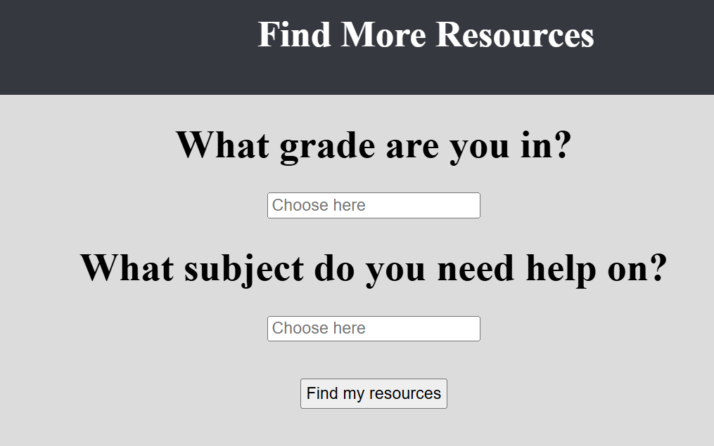

# Introduction
This page was made in 2021, in my Junior year participating in the hackathon Hack The Northeast Beyond.
Me and my good friend Joss first found out about this hackathon from our coding teacher in Highschool. It was open to both highschool and undergrads. We needed two more people for our team, and we met two students from Canada, Lily and Izaan. DATACation provides high school students with a one-stop site to find resources for assistance in Mathematics, English, Science, and Social Studies. Based on the users grade and specified subject they would like assistance with, the website would redirect them to new page consisting of helpful resources the student can use.

# Creating the Site
Being highschool students, we only knew what was taught in our classes. With the limited time we had, we decided to go with what we knew best, instead of picking up a database management system or framework. This meant that the site is made with only HTML, CSS, and Javascript. I personally worked mainly on the backend with Javascript. Coming up with the idea, we wanted to make a directory of sites that would aid students in highschool. It was a little challening working with people in a different time zone, but we were able to make it work in the end with teamwork and planning. 

```js
//declares location of the website to go to
var page = "text";

//This function directs the user to their desired resource website
 function nextPage() {
    //  grabs values from index6
    // sub = subject
    //level = grade level
    var grade = document.getElementById("level").value;
    var subject = document.getElementById("sub").value;
    ...
}
```

Source: <a href="https://annayep.github.io/HTNE2021/"><i class="large github icon"></i>Web Page</a>
GitHub: <a href="https://github.com/AnNaYEP/HTNE2021"><i class="large github icon"></i>GitHub</a>


