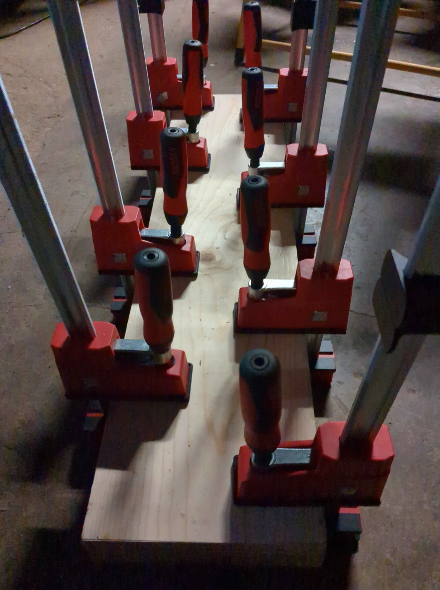

# Introduction
This portable workbench takes heavy inspiration from 3x3Custom's portable workbench build, with the add on of a metal workbench vise. It has 3/4" (20 mm) dog holes for workholding, a twin screw vise for longer pieces of wood, a plane stop, the metal vise mentioned earlier, and legs that can be clamped on any table with clamps. 

# A Beginner's Foot in the Door
The main reason why I decided to get into woodworking as a hobby was because I felt annoyed that I couldn't find drawers the right size that could replace the fabric ones on a hand-me-down drawer unit. I felt the need to take matters into my own hands and make them myself, which led to a rabbit hole of me learning techniques and tools. As I am only a beginner, I decided to build my own workbench, rather than use what my Dad had lying around the shop. This was so that I would not feel bad about damaging or breaking any tools that he would own. The image below is the "final" draft of my bench. 
[]

# Harder than It Looks
I originally felt confident going into the project, as I felt my past experience with planning and building robots for my highschool team could prepare me for working with wood. I was then humbled by the amount of time that would need to be contributed to the project. Working at night was not an option (power tools are loud), I had other obligations over the summer (a campus job and an internship), and making sure what I was doing was right (measure thrice, cut once). I was able to finish the project at the end of the summer, but I have yet to do any full work aside from cutting a log of wood I bought for a coaster. I intend on adding dog holes to the wood jaws of the metal vise so that I may extend the range of the bench dogs on my workbench. I have more to add, but the bench works as is for now, which is good enough at the moment.
[]

# Process
It started with collecting the materials. It took a couple back and forth trips to the hardware stores around me to get both wood and hardware. It started with a glue-up of two wood panels, then a glue-up for the feet. The metal vise was attached with nuts, bolts, and terribly-cut mortises. The dog holes were drilled with a 3/4" drill bit (I ended up breaking a cheap drill extender when drilling for the side holes).
[]

Source: <a href="https://github.com/jogarces/ics-313-text-game"><i class="large github icon "></i>jogarces/ics-313-text-game</a>