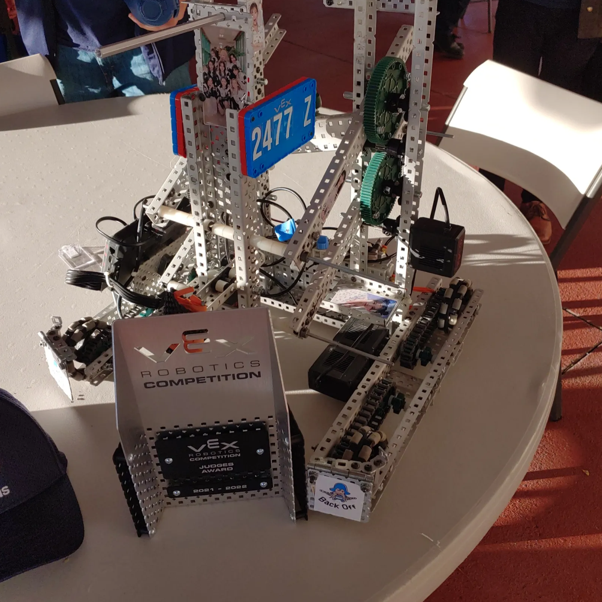

# Introduction
This robot was made for the vex 2022 competition, under Waipahu Highschool's robotics, Team 2477. I unfortunately no longer have posession of the code as it was done on a school laptop, but it was made in C++. I was team captain of the team, but because it was the first time since Covid that the club had activities, membership was reduced to around 7 people, with 2 on my team. There were two other teams with my school, as we wanted to test out all the different ideas we had for the competition.

# Creating the Robot
Following the engineering design process, we quickly prototyped and designed a drivebase and claw for lifting objectives and scoring points. Near the end of the semester, my two teamates got busy with schoolwork, so development struggled. We learned about gears, motors, pneumatics, and machining. We were able to pull through however, and won Judges award at the last qualification tournament for states. While we didn't advance to the states competition, I was satisfied with the progress I was able to make on my first and last year as a builder, designer, driver, programmer, and team captain for my team. 

Front View
[]

Back View
[]
